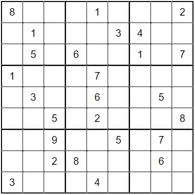
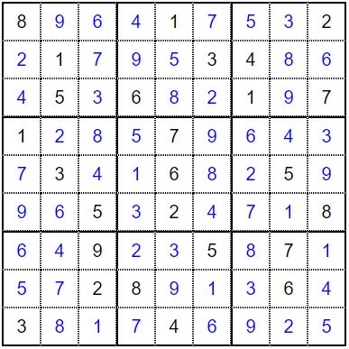

# Automated Reasoning project: CDCL Algorithm
Implement a SAT-solver based on the Conflict-Driven Clause Learning(CDCL) procedure, including the following techniques:
1. First assertion clause heuristic for learning and backjumping (aka. first unique implication point, 1UIP);
2. Two watched literals technique for propagation;
3. A Variable State Independent Decaying Sum(VSIDS) heuristic for decisions;
4. Proof generation.

Optional implementation:
- The transformation of the input in equisatisfiable conjunctive normal form;
- Subsumption;
- Forgetting selectively learned clauses.

No optional requirement has been implemented in this version.

## Usage
The program has been tested on Python v.3.11.4.\
To start the algorithm:
```
usage: path/to/main.py [-h] [--pidgeonhole {5,6,7,8,9}] [--cnf {SAT,UNSAT}] [--sudoku] [--custom]
```
Usage options:
```
options:
  -h, --help            show this help message and exit
  --pidgeonhole {5,6,7,8,9}, -ph {5,6,7,8,9}
                        choose as input one of the pidgeon hole problem instances(all UNSAT)
  --cnf {SAT,UNSAT} 
                        reads input from a file in the test folder based on choice: 
                        uf50-01000 if SAT, uuf50-01000 if UNSAT
  --sudoku, -s 
                        reads input from 'sudoku.txt'
  --custom, -c 
                        reads input from 'custom.cnf'
```
### Multiple input options
There is a priority set for *--sudoku*, *--custom*, *--pidgeonhole* and *--cnf* in the case they're used together in the same execution: first cehcked is *--sudoku*, then *--custom*, if its not present then it chooses the *--cnf* instance and eventually the *--pidgeonhole* instance; if none is used it just reads the input file. Other informations about the DIMACS instances can be found in the respective files.

### Proof of unsatisfiability
The proof is generated only for the resolution steps that brought to the generation of the empty clause, since wrting every learned clause would create a large file(and slow down the execution). Moreover the proof gets written only if the resolution is smaller than 50 steps.

### Model for satisfiability
The model gets always written if the set of clauses is SAT, its a sequence of all the literals that have been assigned with 1(True).
The model, or the proof, can be found in 'output.txt' at the end of the execution.

## Repository Structure
main/\
├── out/\
│&emsp;&emsp;└── output.py&emsp;...contains either the model or the proof if the set of clauses is respectively SAT or UNSAT.\
├── src/\
│&emsp;&emsp;├── arg_parser.py&emsp;...python parser for command line arguments\
│&emsp;&emsp;├── cdcl.py&emsp;...cdcl algorithm and auxiliary methods\
│&emsp;&emsp;├── main.py&emsp;...clause preparation and call to cdcl\
│&emsp;&emsp;├── sastlib_parser.py&emsp;...a parser for files in DIMACS .cnf format\
│&emsp;&emsp;└── retrieval.py&emsp;...functions for Wikipedia texts retrieval\
└── test/\
&emsp;&emsp;&emsp;├── cnf/\
&emsp;&emsp;&emsp;│&emsp;&emsp;├── custom.cnf&emsp;...customizable cnf file\
&emsp;&emsp;&emsp;│&emsp;&emsp;├── ph5.cnf&emsp;...pidgeon hole instance, 5 holes and 6 pidgeons\
&emsp;&emsp;&emsp;│&emsp;&emsp;├── ph6.cnf&emsp;...pidgeon hole instance, 6 holes and 7 pidgeons\
&emsp;&emsp;&emsp;│&emsp;&emsp;├── ph7.cnf&emsp;...pidgeon hole instance, 7 holes and 8 pidgeons\
&emsp;&emsp;&emsp;│&emsp;&emsp;├── ph8.cnf&emsp;...pidgeon hole instance, 8 holes and 9 pidgeons\
&emsp;&emsp;&emsp;│&emsp;&emsp;├── ph9.cnf&emsp;...pidgeon hole instance, 9 holes and 10 pidgeons\
&emsp;&emsp;&emsp;│&emsp;&emsp;├── uf50-01000.cnf&emsp;...SAT instance with 50 variables and 218 clauses\
&emsp;&emsp;&emsp;│&emsp;&emsp;└── uuf50-01000.cnf&emsp;...UNSAT instance with 50 variables and 218 clauses\
&emsp;&emsp;&emsp;├── sudoku.txt&emsp;...sudoku grid instance(described later)\
&emsp;&emsp;&emsp;└── input.txt&emsp;...contains the formatted input clauses

## Input format

The program can either parse a DIMACS file and re-format it, or just read the input file, this is done to improve readability of the test clauses, althought it isn't necessary.
The input file follows this rules:
  - every line represents a clause
  - a well formatted clause matches the following regular expression: "^(¬?([0-9]|[A-Z])\+∨)\*¬?([0-9]|[A-Z])\+$"

### Regex
 - any non-empty sequence of number and uppercase letters is seen as a literal;
 - any literal can be preceded by a '¬' sign;
 - literals can be connected via the '∨' sign zero or more times;
 - the clause ends with the last literal.

If the string does not match the regex the following warning is shown: "String #line is improperly typed!".\
Any string that doesn't match the regex is skipped and the execution starts without it(empty lines trigger the warning).


## Some Benchmarks
| Input File | Clauses | Literals | Result  | Learned Clauses |  Time[s] |
|:----------:|:-------:|:--------:|:-------:|:---------------:|:--------:|
|   ph5.cnf  |    96   |    60    |  UNSAT  |        126      |    0.088 |
|   ph6.cnf  |   133   |    70    |  UNSAT  |        553      |    1.037 |
|   ph7.cnf  |   204   |    80    |  UNSAT  |       2224      |   12.484 |
|   ph8.cnf  |   297   |    90    |  UNSAT  |       4301      |   51.640 |
|   ph9.cnf  |   415   |   110    |  UNSAT  |       9262      |  245.804 |
| sudoku.txt |   3266  |   729    |   SAT   |      10041      |  868.026 |

For more challenging tests some instances from the [SAT competition benchmarks of 2009](http://www.satcompetition.org/) were approached. The algorithm has been left running for about 1h30min each, without terminating, and was then stopped.

## Sudoku instance
Inspired by the CDCL project at [this URL](https://cse442-17f.github.io/Conflict-Driven-Clause-Learning/)(by Add Gritman, Anthony Ha, Tony Quach, Derek Wenger), 
I've decided to implement a Sudoku problem instance as its equivalent SAT instance in CNF(Conjunctive Normal Form).

### Sudoku Rules
An ordinary Sudoku grid is represented as 9x9 square divided in 9 smaller squares, each one of dimension 3x3. To consider a Sudoku completed, every one of the 81 squares in the grid has to be filled with a number from 1 to 9, and the whole grid must satisfy the following constraints:

1. Every 3x3 square contains all 9 numbers without repetitions
2. Every row contains all 9 numbers without repetitions
3. Every column contains all 9 numbers without repetitions

Furthermore a Sudoku grid, to be considered "valid", must be presented with at least 17 cells filled with numbers(clues), thus limiting the possible solutions to 1(the 17 comes from <cite>Gary McGuire and Bastian Tugemann and Gilles Civario[1])</cite>.

### SAT Instance Description
There will be 729 (9x9x9) different literals Xijv, where:

- $1 \leq i,j,k \leq 9$
- i: row number
- j: column number
- v: cell value

Here the SAT encoding for the different constraints:

- $Cell_v = \Lambda_{row=1}^{9}$ $\Lambda_{col=1}^{9}$ $[(row, col, 1), ..., (row, col, 9)]$, each cell has a value;
- $Cell_u = \Lambda_{row=1}^{9}$ $\Lambda_{col=1}^{9}$ $\Lambda_{vi=1}^{8}$ $\Lambda_{vj=vi+1}^{9}$ $¬(row, col, v_i) ∨ ¬(row, col, v_j )$, each cell has only one value;
- $Row_v = \Lambda_{row=1}^{9}$ $\Lambda_{val=1}^{9}$ $[(row, 1, val), ..., (row, 9, val)]$, each row has all values
- $Col_v = \Lambda_{col=1}^{9}$ $\Lambda_{val=1}^{9}$ $[(1, col, val), ..., (9, col, val)]$, each column has all values
- $Block_v = \Lambda_{roff=1}^{3}$ $\Lambda_{coff=1}^{3}$ $\Lambda_{v=1}^{9}$ $V_{row=1}^{3}$ $V_{col=1}^{3}$ $(roff ∗ 3 + row, coff ∗ 3+col, val)$, each block has all values;
- $Clues = \Lambda_{i=1}^{k}$ $(row, col, val)$, $k = initial clues$.

Note that this is not an optimal decsription for the problem, in fact, based on the clues, some constraints become redundant. 

### Sudoku Grid
Clues             |  Solution
:-------------------------:|:-------------------------:
  |  

Here the assignments to the positive literals in 'output.txt'(positive literals decide cell values):
```
| X118 X129 X136 | X144 X151 X167 | X175 X183 X192 |
| X212 X221 X237 | X249 X255 X263 | X274 X288 X296 |
| X314 X325 X333 | X346 X358 X362 | X371 X389 X397 |
|----------------|----------------|----------------|
| X411 X422 X438 | X445 X457 X469 | X476 X484 X493 |
| X517 X523 X534 | X541 X556 X568 | X572 X585 X599 |
| X619 X626 X635 | X643 X652 X664 | X677 X681 X698 |
|----------------|----------------|----------------|
| X716 X724 X739 | X742 X753 X765 | X778 X787 X791 |
| X815 X827 X832 | X848 X859 X861 | X873 X886 X894 |
| X913 X928 X931 | X947 X954 X966 | X979 X982 X995 |
```

## Techniques implementation
Fast overview on how various techniques have been implemented.

### First Unique Implication point(1UIP)
Procedure used if a conflit emerged after propagtion:

1. while the conflict is not an assertion clause we remove steps from the trail;
2. if we find a decision we continue, otherwise its a propagation step;
3. if the propagated literal is in our conflict clause then we perform a resolution wiht the reason;

The assertion clause is then learned.

### Two Watched Literals(2WL)
1. each clause has a list of 2 literals;
2. after propagation/decision of a 0(False) we check the clauses that are "watching" that literal and look for another.

Then there are 3 possible cases:

- Found: change the watched literal;
- Not Found: set watched to 'None'.
- Not Found and Both None: the clause is a conflict clause

We propagate clauses that are watching only 1 literal and we consider a conflict if the watched literals are both None.

### Variable State Independent Decaying Sum(VSIDS)
1. each literal has a counter initialized to 0;
2. when a new clause is learned the counter of every literal occurring inside it gets incremented;
3. literals are kept in a list ordered by descendant VSIDS value;
4. at decision time the first unassigned literal in the list gets assigned 1(True);
5. after 250 clauses learned(chosen randomly) every value is divided by 2 and the list gets reordered.

To optimize the search we memorize the position of the last decided literal:
- every reorder starts the search from the first literal in the list;
- when backjumping the pointer is set to the earliest literal in the list that became unassigned. 

## References
[1] Gary McGuire and Bastian Tugemann and Gilles Civario, "There is no 16-Clue Sudoku: Solving the Sudoku Minimum Number of Clues Problem" in https://arxiv.org/abs/1201.07492013.

[2] Lintao Zhang, Sharad Malik. Validating SAT solvers using an independent resolution-based
checker: practical implementations and other applications. In Proceedings of the Conference
on Design Automation and Test in Europe (DATE), IEEE, pages 10880–10885, 2003.
